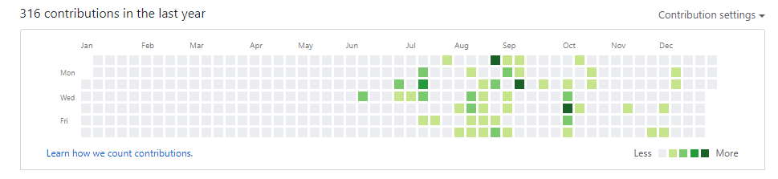

时间匆匆而过，转眼间2019就这么过去了。到了来总结一下的时候了:smile: 

这一年从大二上学期，来到了大三上学期。有收获也很多不足，没有制定一个详细的计划，原因是每当新的一年到来，基本上我都会总结一下去年过的怎么样，然后新的一年要干什么。但是大都是口头励志或者朋友圈跟个风发一下，热度一过，随着时间的推移，慢慢的就忘记了。

还有一个很大的原因是，每当我想要进行一年的规划时，我的内心就会出现一种想法，就是生活是会变的，你根本不知道下一年会有什么任务要干，有可能就会和你的计划冲突了，或许现在没有冲突，但是说不定什么时候就会打乱你的计划。所以每当想到这里，也就基本上结束了我的新年计划，但是我还是会大体列上几个必须完成的目标。

目标是多么的重要，没有目标，我这一年里有很大一部分时间是浪费掉的，没有实现它应该有的价值。在没有东西做的时候我就打游戏了，追剧了，刷综艺了⊙﹏⊙，其实这些空闲时间拿来充电是多么好的一件事情。

## 证书

+ 驾照到手
+ 计算机三级
+ 英语四级（原谅我英语笔试太烂，没有过）
+ 蓝桥杯java组  三等奖
+ 17届山东省软件设计大赛  二等奖
+ 软考中级软件设计师

## Github

18年12月4号建立了创建了GitHub账号然后创建了第一个仓库就再也没有用过。

直到今年暑假才开始用起来，提交率也是很低。

+ 到目前为止2019.12.11，今年的记录有316次
+ 最长连续提交记录只有6天
+ 很多自然周没有任何记录

以前是我意识不够，其实平时也写了很多代码，但是没有什么大型的作品，只是一些练习的小demo就没好意思提交，以后要好好维护我的GitHub。

## CSDN

19年共发了12篇博客 18年只有五篇，而且都是C语言题目的。

和去年相比应该说是有进步的，但是我有写博客的意识的时候已经是下半年了

而且由于以前没有写博客的积累，感觉写的时候无从下手有点艰难。

希望以后多写多练，到时候应该就没有那么难了。

## 学习

这一年我从一个前端小白，对前端一点也不懂，然后到了现在对前端基本上有了一个清晰的认识。知道了以后这条路要怎么走。

+ html css JavaScript
+ php
+ vue
+ node.js
+ Mysql MongoDB
+ 数据结构
+ ajax bootstrap jQuery 
+ Python
+ 等等

这样一总结感觉这一年也学了不少东西。

但是都没有学的很深入，新的一年还要继续努力。

## 成长

这一年， 我的体重从67涨到了78，不  应该说半年时间就长了这么多。（身高180）

这一年，我成为了我们学校前端社区的负责人，组织我们年级还有下一级的前端社区人员进行学习。

这一年，做了三个小项目：作业提交系统、青宠趣跑、小学期排课系统

从中学到了不少东西，懂得了作为负责人要能担责任，能扛事儿才能成事，还有如何使成员之间进行很好的合作，合理安排任务，协调成员的矛盾，以及安抚成员的情绪

## 其他

#### 理财

下半年我开始学习理财了

虽然我没有多少钱，但是有这个想法是没有问题的

每个人都想实现财务自由，所以我认为理财是一条必经之路

#### 运动

年纪越大运动反而越来越少了

除了打打篮球 偶尔跑跑步我好像没有过多的进行运动

所以才会迅速的长胖，特别是到了冬天，天一冷就什么运动也没有了

## 总结

2019年这么整体来看还算可以，但是确实也有很多不足的地方

新的一年也到了我要找工作的时候了，大三下学期结束后，就要开始去实习了。

然而现在的我准备写简历却发现根本没有什么可以写，在学校里虽然过的很充实，生活也不错，但是却没有什么特别出彩的地方，大都是普普通通的在学习，也没有干一个什么特别大的项目。

所以还有半年的时间给我去准备，要多给自己的简历上增加一些内容

加油！目标杭州，希望7个月后可以得到一个满意的公司的offer

**走过必须走的路，才能走想走的路**

