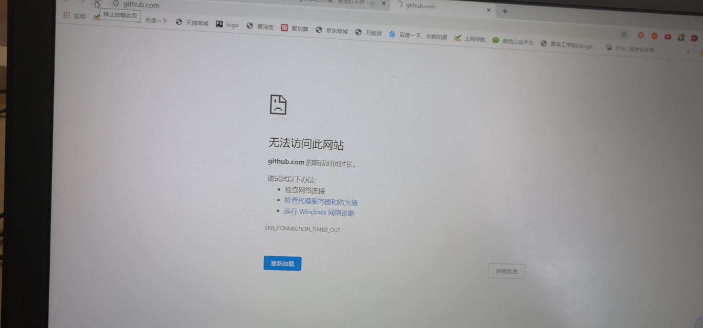

## github 打不开怎么办？

本来在学校用的好好的github今天回到家就打不开了，一下子我就疑惑了，难道是我家WiFi的原因？

于是我就打开了热点，可是还是不行。如下图所示，显示反应时间过长。

然后我就开始百度，结果发现：

有人使用github后，在某些网络下发现打开慢，甚至打不开，这都是因为他是国外站；目前互联网的连接机制导致超过一定的路由节点的连接就会出现这个问题，解决办法就是直接告诉本机ip。

然后我就得到了下面这些ip和网址

192.30.253.112 github.com
192.30.253.119 gist.github.com
151.101.100.133 assets-cdn.github.com
151.101.100.133 raw.githubusercontent.com
151.101.100.133 gist.githubusercontent.com
151.101.100.133 cloud.githubusercontent.com
151.101.100.133 camo.githubusercontent.com
151.101.100.133 avatars0.githubusercontent.com
151.101.100.133 avatars1.githubusercontent.com
151.101.100.133 avatars2.githubusercontent.com
151.101.100.133 avatars3.githubusercontent.com
151.101.100.133 avatars4.githubusercontent.com
151.101.100.133 avatars5.githubusercontent.com
151.101.100.133 avatars6.githubusercontent.com
151.101.100.133 avatars7.githubusercontent.com
151.101.100.133 avatars8.githubusercontent.com

**复制这些到你电脑的hosts粘贴就可以了。**

就在我粘贴完后，又出现了一个问题，就是没办法修改hosts没有权限。

hosts在你电脑的这个目录下：

C:\Windows\System32\Drivers\etc

如果你也没办法修改，就点开hosts的属性，

选择高级，在权限界面下面有个更改权限，

在新弹出的对话框里点击添加按钮，

点击hosts的权限项目窗口下面的主体的“选择主体”

点击进入选择用户或组界面，点击高级

点击高级后，我们接着在点击理解查找，然后在查找结果里找到当前用户的账号，选中后点击确定，

在选择用户或组界面里点击确定

将hosts的权限项目界面下的基本权限的所以项目都勾选上，然后点击确定

然后就可以修改了。

改完后再把那些ip复制上，你就可以访问github了。