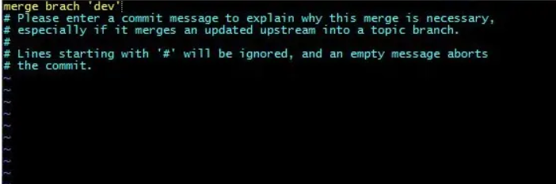

**解决git 在pull或者合并分支的时候出现Please enter a commit message to explain why this merge is necessary？？？**

什么鬼**？？？**

第一次见这个的时候我蒙了。根本不知道是什么意思？

也不知道应该按那个键，然后我就干脆关了，重新打开一遍。

然后居然行了。哈哈感觉自己真实一个天才！

再后来从仓库上拉代码的时候又出现了这个问题，我又关了然后再打开。

**直到第三次遇到，我想我不能一直这样吧，我得弄明白是什么原因才行，然后我就开始百度。**

然后我百度了第一句话的意思：

Please enter a commit message to explain why this merge is necessary.

请输入一条提交消息来解释为什么需要合并。

原来是这个意思啊，就是让你添加一个解释或说明，就和git commit -m"" 一样。

**如果你想写：**

1. *按键盘字母 i 进入insert模式*
2. *修改最上面那行黄色合并信息,可以不修改*
3. *按键盘左上角"Esc"*
4. *输入":wq",注意是英文的冒号+wq,按回车键即可*

**如果你不想加注释：**

1. 按键盘左上角"Esc"
2. 输入  :wq  按回车键即可(冒号+wq)

