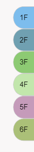
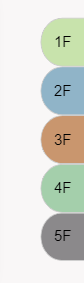
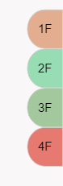

# vue 解决v-for 循环列表生成不同背景颜色问题

**今天在做项目的时候我就遇到一个问题，效果图是这样的：**



- 这是一个表示楼层数的列表，根据不同建筑有不同的楼层，每一层楼都要有不同的背景颜色。
- 要是一个一个的写楼层加背景太麻烦了。
- 而且你根本没法写完，因为有多少了楼多少层你根本没法统计。
- 在说了，身为一个合格的前端，怎么只能写那些死页面。
- 下面给大家看一下，我是怎么实现的上面效果。

**首先这是`html`代码**

```  html
  <ul> 
 	 <li v-for="count in this.floor" 
     :key="count" :style="randomRgb(item)" > {{count}}F</li>
  </ul> 
```

​      用过style绑定一个函数如下：

``` javascript
 randomRgb(item) {
        let R = Math.floor(Math.random() * 130+110);
        let G = Math.floor(Math.random() * 130+110);
        let B = Math.floor(Math.random() * 130+110);
        return {
          background: 'rgb(' + R + ',' + G + ',' + B + ')'
        };
      }
```

在里面可以设置颜色 ` Math.floor(Math.random() * 130+110)` 这里面的数值可以自己改，来控制颜色的大体范围。最后通过 `return` 返回给 `style` 

最上面这个 `this.floor` 是后端传过来的参数，你要是求简单可以自己在 `data` 里写一个。

就这样就实现了。

要是还有问题的可以留言联系我。

