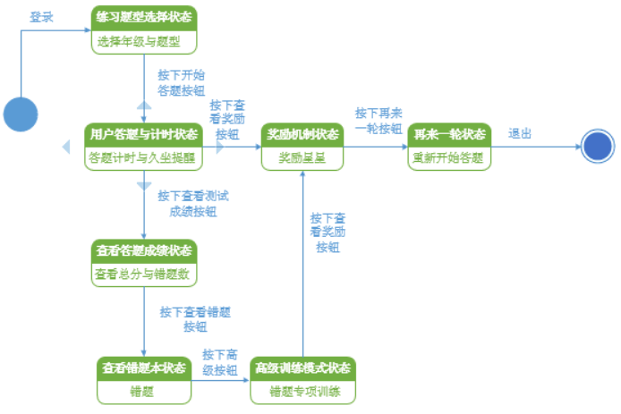
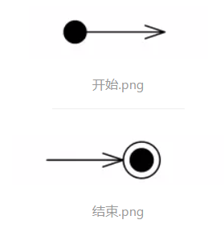
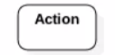
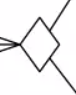
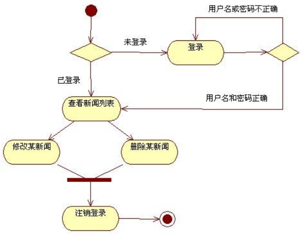

## 状态图和活动图的区别

#### 状态图

1. 状态图描述一个特定对象的所有可能状态以及由于各种事件的发生而引起的状态之间的转移。状态图侧重于从行为的结果来描述，只涉及一个特定的对象，常用于动态特性建模。 

2. 状态图的组成

   （1）起点、终点

   （2）状态

   主要用来描述一个对象在生命周期内的一个时间段。状态包括：状态名、内部转移、进入/退出操作、子状态、延迟事件等状态的特征。

   （3）转换

   两个状态之间的关系，即当发生指定事件并满足指定条件时，第一个状态中的对象将执行某些操作进入第二个状态。

   （4）事件

   事件可以分为几种：信号事件、调用事件、改变事件、时间事件等。

   

#### 活动图

1. 活动图描述了一次行为活动的流程，主要强调了行为活动的**顺序和条件控制** 

2. 活动图的组成

   （1）开始和结束状态

   

   （2） 活动：标示动作 

   

   （3） 控制流：链接活动 

   

   （4） 决策:条件判断 

   

   

#### 活动图和状态图的区别

+ 描述对象不同

  状态图描述对象状态及状态之间的转移

  活动图描述到活动的控制流

+ 使用场合不同

  状态图描述对象在其生命期中的行为状态变化

  活动图描述过程的流程变化

+ 状态图侧重从行为的结果来描述（状态）

  活动图侧重从行为的动作来描述（活动）

+ 状态图重点在于描述对象的状态及其状态之间的转移

  活动图描述的是对象活动的顺序关系所遵循的规则，它着重表现的是系统的行为，而非系统的处理过程。

  活动图能够表示并发活动的情形，活动图是面向对象的。