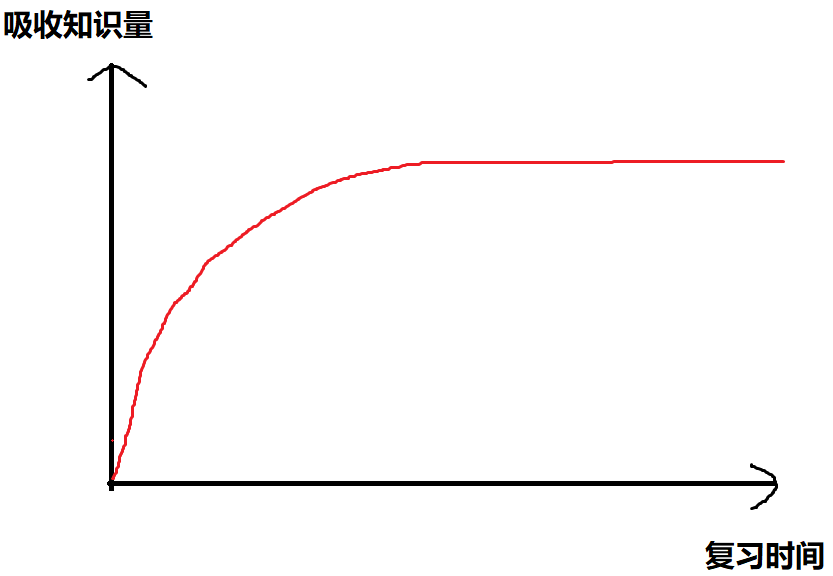

## 突然灵机一动

#### 期末考试

下一周就要进行期末考试了，今天晚上我在进行复习的时候，脑子里突然闪出一个想法。

就是**花大量的时间进行复习到底值不值得？**

我是这么想的，经过三年大学期末考试的实践，其实大学的期末考试就靠最后那两天的突击。

最后复习课上认真听好老师给说的题型以及范围，再加上回去后努力一番，过60肯定没问题。

虽然都是最后几天复习突击，但是经过我的观察，最后突击也可以分成好几种

***

+ 提前一周左右开始的

1. 这种一般是平时上课认真听讲的同学
2. 根据老师复习课讲的，拿着课本和课件自己复习
3. 根据老师复习课讲的，拿着课本和课件几个人结伴复习
   - 这时候在他们复习的时候，有一部分人还在宿舍打游戏、追剧，一点也不慌的样子

+ 提前2-3天开始复习的

1. 这种一般是平时上课稍微听讲的同学
2. 他们会先问一下哪些提前一周就开始复习的同学
3. 然后根据老师和提前一周开始复习的同学的总结，结合他们的想法开始复习
   + 这时候还有人不慌，就是有心态好的人，及时潇洒及时行乐

+ 明天考试开始复习的

1. 这种基本上是平时上课不听讲的同学
2. 他们根本不知道老师最后说的什么
3. 只能问第一种和第二种同学，根据他们说的来复习

---

**最后你会发现，哪些提前很久就开始复习的同学不一定就考高分，有的甚至不如明天考试今天才开始复习的同学考的高。这是什么原因呢？**

##### 上图是我总结的期末考试复习图

其实哪些越往后开始复习的人，他们越紧张，那时候离考试时间近，所以他们就比较投入，再加上，提前已经有人把复习资料整理出来了，所以他们的效率也就高一些。

从上图可以看出，基本上一开始你什么也不会的时候，吸收知识是很快的，可以很快的掌握大部分的知识点,而你复习时间很长也不一定就比人家多学了多少，只不过是在巩固，多学的那一点，考试要是再不考，就白学了

**这就是为什么复习时间长还不一定考高分的原因**

所以我才会产生一开始的那个疑问？

就是我是花一天时间突击一下，保证自己不挂科就行，还是多花点时间复习，在吸收大部分知识的基础上再慢慢吸收一些，争取考一个高分（*考高分是有一定难度的，因为老师期末复习只给差不多80分左右的复习范围，剩下的就看你自己的积累了，所以越往后复习的就越缥缈*）

如果是突击复习，节约下来的时间我可以学习其他的东西，可以敲敲代码什么的，但是可能导致我的成绩出来不理想，然后我会不是那么高兴，老师也会说我。要是花时间复习了，我又感觉复习时间那么长，却比哪些复习一会的人高不了几分，而白复习了。

~~所以我很矛盾~~

***哎，不说说了，思考那么多也没有用，好好复习才是硬道理，我还是多多复习考一个高分吧！***

